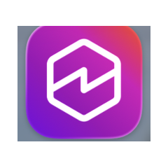

# RTF on EKS Auto Mode - POC Runbook

<p align="center">
  &nbsp;&nbsp;&nbsp;
  &nbsp;&nbsp;&nbsp;
  &nbsp;&nbsp;&nbsp;
  
</p>

<p align="center"><em>A joint AWS + MuleSoft solution, built with AI assistance from Amazon Quick, Kiro, and Claude Code.</em></p>

Repeatable scripts to stand up MuleSoft Runtime Fabric on an Amazon EKS
Auto Mode cluster, with a working public ALB endpoint using a real domain.

Currently pinned to **Kubernetes 1.35** and **Runtime Fabric 3.0.277**
(latest confirmed versions as of this writing - see lesson 11 in "Key
Learnings" below before bumping either further).

## Prerequisites

- `eksctl` (0.195.0+ - `autoModeConfig` is rejected as an unknown field on
  older versions, silently creating a cluster WITHOUT Auto Mode rather than
  erroring; `02-create-cluster.sh` checks this for you and fails fast with
  a clear message if your version is too old), `aws` CLI (2.15+), `kubectl`,
  `helm` installed
- AWS SSO session active (`aws sso login`)
- Anypoint account with RTF entitlement
- `license.lic` (Mule Enterprise license file)
- `values.yaml` - NOT required. `08-install-rtf.sh` generates one
  automatically from MuleSoft's documented schema if this file isn't
  present. Only download and place a real `values.yaml` here (from
  Anypoint Runtime Manager → Runtime Fabrics → Helm install method) if
  you need optional parameters the generated one doesn't include (see
  lesson 14 below) - a real file, if present, always takes precedence.
- A domain you own, with access to add DNS records at whatever registrar
  or DNS provider manages it. Set `DOMAIN` in `rtf-config.env` (picked up
  automatically by `09-setup-ingress-template.sh` and
  `10-apply-ingress-template.sh` via `rtf-fabric.env` if you ran
  `07-register-fabric.sh`), or edit `DOMAIN` directly at the top of both
  scripts if you're skipping fabric-registration automation. This is what
  enables hostname-based routing with zero Mule app changes - see lesson
  9 below for why this matters. A Route 53 hosted zone is NOT required;
  `09-setup-ingress-template.sh` prints one manual CNAME record to add at
  whatever DNS provider you actually use.

## First-Time Setup (New User / New Machine)

If you're picking up this runbook for the first time - especially on a
different Salesforce-controlled AWS account - complete this checklist
before running any scripts.

### 1. Install tooling

```bash
# Mac via Homebrew
brew install eksctl awscli kubernetes-cli helm
```

Confirm versions:
```bash
eksctl version    # need 0.190.0+
aws --version     # need 2.15+
kubectl version --client
helm version
```

### 2. Configure AWS SSO access

```bash
aws configure sso
```

You'll be prompted for your org's SSO start URL (e.g.
`https://salesforce.awsapps.com/start` - confirm the exact URL with your
cloud ops/IT team if unsure). Then:

```bash
aws sso login --profile <your-profile>
export AWS_PROFILE=<your-profile>
aws sts get-caller-identity   # confirms auth is working
```

**AWS SSO tokens expire mid-session** - if a script fails with an
`ExpiredTokenException` or "server has asked for the client to provide
credentials," just re-run `aws sso login` and retry the script.

### 3. Confirm required IAM permissions

Steps 03 (OIDC) and 04 (ALB/IRSA) require your SSO role to have:

- `eks:*`
- `ec2:*`
- `cloudformation:*`
- `iam:CreateRole`
- `iam:CreateOpenIDConnectProvider`
- `iam:AttachRolePolicy`
- `iam:CreatePolicy`

If your SSO role is more locked down than this, scripts 03/04 will fail
with `AccessDenied`. If that happens, this needs to go to your cloud
ops/IAM admin team - it is not something you can self-serve around. Ask
them specifically for OIDC provider association and IRSA role creation
rights on the `rtf-automode-poc` cluster (or whatever you rename it to).

### 4. Get your own Anypoint / RTF credentials

These are per-person and tied to your own Anypoint org - you cannot reuse
a colleague's activation data or license:

- **Activation data** - Anypoint → Runtime Manager → Runtime Fabrics →
  Create Runtime Fabric → select Helm as install method → copy activation
  data
- **`values.yaml`** - downloaded from that same screen
- **Registry username/password** - shown alongside activation data
- **`license.lic`** - your org's Mule Enterprise license file

Do not share activation data between people/fabrics - it's scoped to a
single Runtime Fabric registration in Anypoint.

### 5. Avoid resource name collisions

If you're running this in the **same AWS account** as a colleague who has
also run this runbook, rename resources to avoid collisions:

- Cluster name in `rtf-automode-v3.yaml` and all scripts
  (e.g. `rtf-automode-poc` → `rtf-automode-poc-jsmith`)
- The `AWSLoadBalancerControllerIAMPolicy` IAM policy is account-scoped
  and shared - script 04 already checks if it exists before creating it,
  so this one is safe to share across users in the same account.

If you're in a **different AWS account**, no renaming is needed.

### Pre-Flight Checklist

```
[ ] eksctl, aws cli, kubectl, helm installed and correct versions
[ ] aws sso login working, aws sts get-caller-identity returns identity
[ ] Confirmed IAM permissions (iam:CreateRole, CreateOpenIDConnectProvider, AttachRolePolicy, CreatePolicy)
[ ] Own Anypoint org access with RTF entitlement confirmed
[ ] Own activation data + values.yaml + license.lic ready
[ ] Cluster name updated if sharing an AWS account with others
```

## Execution Order

```bash
chmod +x *.sh

./01-delete-cluster.sh              # ~10 min - only needed if starting over
./02-create-cluster.sh              # ~15-20 min
./03-create-storageclass.sh         # ~1 min  - REQUIRED: Auto Mode ships no StorageClass;
                                     #           without it every PVC (RTF's and any app's)
                                     #           stays Pending
./04-setup-oidc.sh                  # ~1 min  - REQUIRED for IRSA, easy to miss
./05-install-alb.sh                 # ~3 min  - installs ALB controller with real IAM creds
./06-add-nodepool.sh                # ~1 min  - amd64 nodes for RTF (Auto Mode defaults to arm64)
./07-register-fabric.sh             # ~1 min  - AUTOMATES the "Create Runtime Fabric" UI step AND
                                     #           environment association via the Anypoint Runtime
                                     #           Fabric API. Configure via rtf-config.env (copy
                                     #           from rtf-config.env.example) - see below. Defaults
                                     #           to the "Sandbox" environment by name. Writes
                                     #           rtf-fabric.env for 08-install-rtf.sh.
./08-install-rtf.sh                 # ~5 min  - uses rtf-fabric.env if 07 was run, otherwise
                                     #           fill in credentials manually first, see below.
                                     #           If 07 was skipped, you still need to manually
                                     #           associate the environment - see "After Running
                                     #           08-install-rtf.sh" below.
./09-setup-ingress-template.sh      # ~5 min  - forces ALB creation via a keep-alive service,
                                     #           captures its real hostname, and prints the
                                     #           one-time manual CNAME to add. Non-interactive -
                                     #           does NOT wait for you to add it; just exits with
                                     #           instructions. Safe to invoke from automation
                                     #           (e.g. a Claude skill) with no blocking prompt.
./10-apply-ingress-template.sh      # ~1 min  - run after adding the CNAME (immediately, or any
                                     #           time later - re-derives everything itself rather
                                     #           than depending on 09 having just run). Applies
                                     #           the HTTPRouteTemplate. Does a quick, non-blocking
                                     #           DNS propagation check first (informational only -
                                     #           proceeds either way).
./11-validate.sh                    # ~2 min  - full post-install check
```

After this, deploy an app in Runtime Manager - the Ingress tab will show
`http://*.<your-domain>` as an available host pattern. The app will be
reachable at `http://<app-name-or-chosen-subdomain>.<your-domain>/` with
no Host header override and no app code changes needed.

## Before Running 07-register-fabric.sh (Optional - Automates Fabric Creation AND Environment Association)

This script replaces two manual UI steps using the
[Runtime Fabric API](https://anypoint.mulesoft.com/exchange/f1e97bc6-315a-4490-82a7-23abe036327a.anypoint-platform/runtime-fabric/):
"Runtime Manager → Runtime Fabrics → Create Runtime Fabric", and
associating the resulting fabric with an Anypoint Environment. Skip it and
do both manually instead if you'd rather not set up a Connected App, or if
you hit issues with the `vendor` value flagged in the script's comments
(see lesson 13 below - confirmed end-to-end working as of 2026-09-03,
with only the `vendor: "eks"` value still not independently verified
against the interactive API reference; everything else, including
`helmrepoproperties`'s exact field names and the environment-association
call, has been confirmed against real API responses).

**Configure it once, without editing the script:**
```bash
cp rtf-config.env.example rtf-config.env
```
Then edit `rtf-config.env` (not the script) and fill in:
- `ORG_ID` - your Anypoint organization ID (Access Management → your org
  → the ID shown in the URL or organization details)
- `CLIENT_ID` / `CLIENT_SECRET` - from a Connected App with Runtime
  Fabric management scope: Access Management → Connected Apps → Create
  App → "App acts on its own behalf (client credentials)" → grant
  Runtime Manager / Runtime Fabric scopes
- `FABRIC_NAME` / `REGION` - defaults are usually fine, adjust if needed
- `ENVIRONMENT_NAME` - defaults to `"Sandbox"`; the script looks this up
  by name via the Environments API and resolves it to an ID
  automatically. Change it if you want a different environment (e.g.
  `"Design"`, `"Production"`) - must match the name exactly as it
  appears in Anypoint. Alternatively, set `ENVIRONMENT_ID` directly (a
  UUID, from Access Management → Environments → click your target
  environment → the ID is shown in the URL/details) to skip the
  name-lookup step entirely.
- `DOMAIN` - a domain/subdomain you own (see the Prerequisites section
  above). Not used by `07-register-fabric.sh` itself - just passed
  through into `rtf-fabric.env` so `09-setup-ingress-template.sh` and
  `10-apply-ingress-template.sh` can pick it up automatically too, the
  same way `08-install-rtf.sh` already picks up
  `ACTIVATION_DATA`/`REGISTRY_USER`/`REGISTRY_PASS`.

`rtf-config.env` is loaded automatically every time you run the script -
fill it in once and it's reused across runs, and across re-downloads of
this runbook (as long as you keep the file). It contains real credentials
- do not commit it to version control or share it (only
`rtf-config.env.example`, which has no real values, is safe to share).

**Alternative - shell environment variables:** if you'd rather not keep a
credentials file on disk at all, `export ORG_ID=... CLIENT_ID=...
CLIENT_SECRET=...` (etc.) in your shell before running the script -
exported variables take precedence over `rtf-config.env` if both are
present.

Requires `jq` (`brew install jq` if not already installed).

## Before Running 08-install-rtf.sh

If you ran `07-register-fabric.sh` successfully, this script picks up
`ACTIVATION_DATA` and registry credentials automatically from
`rtf-fabric.env` - no manual editing needed for those.

Otherwise (or if `07-register-fabric.sh`'s credential-fetching step
failed), edit the top of the script and fill in the FALLBACK VALUES
section:
- `ACTIVATION_DATA` - from Anypoint Runtime Manager → Runtime Fabrics → Create Runtime Fabric → Helm
- `REGISTRY_USER` / `REGISTRY_PASS` - registry credentials shown in the same Anypoint screen

Either way, you still need to:
- Have your Mule Enterprise license file as either `license.lic` (the
  script auto-generates `license.b64` from it) or `license.b64` directly
  already base64-encoded

`values.yaml` is generated automatically - no manual download needed
unless you require optional parameters not covered by the generated
version (see lesson 14 below). If you do place a real `values.yaml` in
this directory, it's used instead of the generated one automatically.

## After Running 08-install-rtf.sh

If you ran `07-register-fabric.sh`, environment association already
happened automatically before the fabric was even installed - no further
action needed here.

If you skipped `07-register-fabric.sh` and created the fabric manually
instead, you still need to **associate this Runtime Fabric with a
MuleSoft Environment** before you can deploy any app to it. Once the Helm
install completes and the RTF agent connects (status changes from
"Disconnected" to "Active" in Runtime Manager → Runtime Fabrics), do this
manually:

1. Anypoint Platform → Runtime Manager → **Runtime Fabrics**
2. Select the fabric you just installed (`rtf-automode-poc`, or whatever
   name you gave it)
3. Find the **Environment** association setting (typically under the
   fabric's details/settings) and select the Environment you want to
   deploy apps into (e.g. Sandbox, your dev/demo environment)
4. Save

Without this, the fabric won't appear as a valid **Deployment Target**
option when deploying an app in Runtime Manager, even though the fabric
itself shows as connected/healthy.

## Key Lessons Baked Into These Scripts

1. **OIDC provider must exist before IRSA works.** `eksctl create iamserviceaccount`
   fails with "no IAM OIDC provider associated" if step 03 is skipped.

2. **EKS Auto Mode blocks pod-level IMDS access by design** (SSRF protection,
   hop-limit=1). Attaching an IAM policy to the node role does NOT work for
   pods - only IRSA (a real service-account-scoped IAM role) provides working
   credentials to the ALB controller. `serviceAccount.create=true` in the Helm
   chart alone is not enough; you need `eksctl create iamserviceaccount` first,
   then install Helm with `serviceAccount.create=false`.

3. **Auto Mode defaults to arm64 (Graviton)** for cost. RTF images are amd64
   only, so a dedicated amd64 NodePool (Karpenter, `karpenter.sh/v1` API group)
   is required.

4. **`--kubernetes-network-config` on `update-cluster-config`** enables ALB at
   the API level but does NOT deploy an ALB controller pod - AWS's managed
   add-on for `aws-load-balancer-controller` is not available on K8s 1.32, so
   the controller must be installed manually via Helm.

5. **RTF ingress uses a template pattern, not a direct Ingress object.**
   - The template lives in the `rtf` namespace with `ingressClassName: rtf-alb`
     (must have the `rtf-` prefix - this is how the RTF agent recognizes it
     as a template rather than a live ingress).
   - The `rtf-alb` IngressClass object must exist (with a non-ALB controller
     string) purely to satisfy the AWS Load Balancer Controller's admission
     webhook, which validates that referenced IngressClasses exist.
   - RTF's agent reads the template and generates real per-app Ingress objects
     (with the real `alb` class) in each app's namespace, based on host/
     subdomain/path chosen in Runtime Manager's **Ingress** tab at deploy time.
   - Include `alb.ingress.kubernetes.io/group.name` in the template annotations
     so multiple app ingresses share one ALB cleanly.
   - **Routing pattern - path-based on the raw ALB hostname (no host set):**
     our template omits the `host` field, so ALB matches any host, including
     its own raw ELB DNS name. This means apps are reachable directly at
     `http://<alb-dns-name>/<app-name>/...` with **no custom DNS and no
     `-H "Host:"` override needed** - mirrors the pattern used in MuleSoft's
     reference Nginx setup. The tradeoff: because ALB does not support URL
     rewriting, the Mule app's HTTP listener must be configured with
     `basePath="${app.name}"` so it expects the `/<app-name>` prefix:
     ```xml
     <http:listener-config name="HTTP_Listener_config" ...>
       <http:listener-connection host="0.0.0.0" port="8081" basePath="${app.name}" />
     </http:listener-config>
     ```
     An alternative (subdomain-per-app with a `host: "*.example.com"` rule)
     avoids the `basePath` coupling entirely but requires either a Host
     header override for testing or a real DNS record (Route 53) pointing
     at the ALB for a polished demo. Path-based routing was chosen here to
     match customer environments that want a single stable URL with no DNS
     setup.
   - Also note ALB has a 100-ingress-resource-per-group limit - worth
     flagging for customers planning to run many apps on one cluster.

6. **AWS SSO tokens expire mid-session.** Every script checks
   `aws sts get-caller-identity` first and fails fast with a clear message
   rather than halfway through a multi-step operation.

7. **`eksctl delete cluster` can leave an orphaned CloudFormation stack**
   if interrupted. Script 01 waits for full stack deletion before returning.

8. **Deleting the cluster without deleting Ingress/LoadBalancer objects first
   orphans the ALB/NLB in AWS.** The AWS Load Balancer Controller only
   deprovisions load balancers in response to the Kubernetes Ingress/Service
   object being deleted - it has no chance to clean up if the whole cluster
   (and the controller pod along with it) disappears first. This can leave
   you paying for an orphaned ALB indefinitely, and can also cause
   `eksctl delete cluster` to hang or fail if the VPC/subnets/security
   groups still have a dependent load balancer attached. Script 01 now
   deletes all Ingress objects and `type: LoadBalancer` Services first,
   waits 60s for the controller to deprovision them, and finally checks
   for any orphaned ALBs matching the cluster's naming pattern after
   deletion completes.

9. **The recommended, customer-safe pattern: hostname-based routing via a
   real wildcard DNS record - zero Mule app changes.** This is RTF's
   native, designed approach: every app gets its own subdomain and listens
   unmodified at `/`, exactly as it does when tested locally in Studio.
   This is the pattern documented here and the one to use for any
   customer-facing setup - an existing customer should never be asked to
   modify their app just to fit an ingress topology, and should never be
   asked to add a DNS record per app either.
   - Nginx's load balancer is provisioned once, upfront, at controller
     install time, so its hostname is known before any ingress template is
     written. ALB is different: the load balancer is created dynamically
     per ingress *group*, and its hostname isn't assigned until an Ingress
     referencing that group exists - a chicken-and-egg problem when you
     want the final template to reference a real domain from the start.
   - `09-setup-ingress-template.sh` solves this by deploying a tiny,
     permanent "keep-alive" backend (`nginx:alpine` pod + Service) with
     its own plain Ingress using the **real** `alb` class directly (not
     RTF's template mechanism) - purely to force the ALB into existence
     and capture its (stable) hostname.
   - **DNS step is manual and one-time, not automated, and not
     per-app.** An earlier version of this script automated a Route 53
     wildcard ALIAS record by NS-delegating a subdomain to a Route 53
     hosted zone. That was abandoned after confirming - via repeated
     direct queries against the domain's own authoritative nameservers,
     including a full delete-and-recreate retry of the NS records - that
     the registrar used for the demo domain in this runbook (Squarespace,
     sitting on top of Google Cloud DNS) accepts NS records in its UI but
     does not actually serve them. This is a real platform limitation of
     that specific registrar, not a configuration mistake; it may not
     apply to your own domain/registrar.
   - Since the ALB's hostname is **stable** across every app deployment
     (that's the entire point of the keep-alive backend), the fix is
     simpler than the automation it replaces: **one manual CNAME record,
     created once**, is functionally identical to what the automation
     would have produced - `Type: CNAME, Name: *.rtf (or your chosen
     subdomain), Data: <the ALB hostname the script prints>`. This is a
     one-time setup step, comparable to pointing any custom domain at a
     SaaS platform - it is emphatically **not** the "add a record per
     app" pattern, which would be unreasonable to ask of customers. Every
     app deployed after this one record exists just works, with zero
     further DNS changes.
   - **Split into two non-interactive scripts** so the whole runbook can
     be invoked from an automated context (e.g. a Claude skill) without
     ever blocking on a terminal prompt: `09-setup-ingress-template.sh`
     forces ALB creation, prints the CNAME to add, and exits;
     `10-apply-ingress-template.sh` applies the `HTTPRouteTemplate`,
     run separately once the CNAME is in place. `10` re-derives the ALB
     hostname itself from the still-running keep-alive Ingress rather
     than depending on any state left behind by `09`, so it's safe to run
     standalone, re-run, or invoke long after `09` completed. It also
     runs a quick, non-blocking DNS-propagation check first (a wildcard
     probe hostname) - purely informational, since applying the template
     doesn't actually depend on DNS having propagated yet.
   - **If your registrar correctly supports NS delegation**, automating
     this via a delegated Route 53 hosted zone (as an earlier version of
     this script did) remains a reasonable choice, and removes even the
     one manual step - see git history for that version if needed. Test
     it end-to-end (a delete-and-recreate cycle of the NS records, plus a
     direct query against your domain's own authoritative nameservers,
     not just a recursive lookup) before relying on it, given what was
     found here.
   - Every app deployed afterward is reachable at
     `http://<app-name-or-chosen-subdomain>.yourdomain.com/` with **no
     Host header override and no app code changes** - confirmed to match
     the exact behavior of local Studio testing.
   - **Do not delete the `rtf-keepalive` Ingress/Service/Deployment** in
     the `rtf` namespace - it's what keeps the ALB (and therefore the
     CNAME's target) alive. If it's ever removed and the ALB is torn
     down, re-run this script to force a new one, then update the CNAME
     record to the new ALB hostname.
   - **Not yet added: TLS.** The current template is HTTP-only. For a
     real customer-facing demo, issue or import a wildcard ACM
     certificate for `*.yourdomain.com`, add a `tls:` block referencing a
     Kubernetes TLS secret to the Ingress resource inside the
     `HTTPRouteTemplate`, and switch `baseEndpoints` to
     `https://*.yourdomain.com`. See the "Use TLS in the HTTP Route-
     Template Custom Resource" section of MuleSoft's docs for the
     `rtf.mulesoft.com/synchronized: "true"` secret label, which lets RTF
     manage the TLS secret's lifecycle across all app namespaces
     automatically.
   - **Path-based routing on the legacy Ingress-template mechanism was
     investigated and abandoned for customer-facing use** (kept here for
     historical context only): an earlier iteration hand-wrote a raw
     Ingress object as the RTF template (using a fake `rtf-alb`
     IngressClass purely to satisfy the AWS Load Balancer Controller's
     admission webhook) with a single, AWS-generated ALB hostname and
     path-based routing (`/app-name/*`). That avoided needing a domain,
     but required each Mule app's HTTP Listener to set **Base path** to
     `${app.name}`, since ALB (unlike Nginx) does not rewrite the
     forwarded URL - a non-starter for existing customer apps. A native
     AWS ALB URL-rewrite feature (`alb.ingress.kubernetes.io/
     transforms.<name>`, GA'd Oct 2025) was tested as a way to avoid the
     Base path change entirely, but doesn't work with that legacy
     mechanism's literal-string substitution: it substitutes tokens found
     in annotation *values* but not annotation *keys*, and AWS requires
     the `transforms.<name>` suffix to exactly match the real backend
     service name for the rule to apply - so the mismatch causes AWS to
     silently ignore the transform. Migrating to `HTTPRouteTemplate`
     (lesson 10) sidesteps this category of problem entirely, since its
     placeholders are explicit and documented rather than inferred.

10. **Migrated to RTF's `HTTPRouteTemplate` CRD (`rtf.mulesoft.com/v1`),
    the officially recommended ingress mechanism as of RTF 3.0.102+,
    replacing the legacy hand-written-Ingress-as-template approach used
    in earlier iterations of this runbook.** See:
    <https://docs.mulesoft.com/runtime-fabric/latest/configure-ingress-http-resource>
    - RTF still supports the old style (a raw `Ingress`/`Route`/`HTTPRoute`
      object placed in the `rtf` namespace with informal token
      substitution), but the docs explicitly recommend `HTTPRouteTemplate`
      going forward, and if both exist with overlapping `baseEndpoints`,
      the `HTTPRouteTemplate` takes precedence.
    - **No more fake `rtf-alb` IngressClass needed.** The legacy mechanism
      required a placeholder IngressClass purely so the real ALB
      controller's admission webhook wouldn't reject a raw Ingress
      referencing a non-existent class. `HTTPRouteTemplate`'s `resources`
      entries are template strings RTF interprets itself, not live
      Kubernetes objects subject to that webhook until *after* RTF
      generates the real per-app resource - so the template can (and
      should) reference the **real** `ingressClassName: alb` directly.
    - **Explicit, documented placeholders instead of inferred literal-
      string substitution.** Available placeholders: `{{ .ResourceName }}`
      (unique name, recommended for every generated resource),
      `{{ .ApplicationName }}`, `{{ .Namespace }}`, `{{ .Service.Name }}`,
      `{{ .Service.PortName }}`, `{{ .Service.Port }}`, `{{ .Host }}`,
      `{{ .Path }}`, `{{ .OrganizationID }}`, `{{ .EnvironmentID }}`,
      `{{ .UniqueID }}`. As of RTF 3.0.102, the Runtime Manager UI no
      longer treats bare legacy strings like `app-name` as placeholders
      for `HTTPRouteTemplate`-based deployments - only the Handlebars
      syntax works, which is exactly what caused our earlier `transforms`
      annotation-key experiment to fail (that was against the legacy
      mechanism, before this migration).
    - `baseEndpoints` (e.g. `http://*.yourdomain.com`) controls what host
      patterns Runtime Manager offers application developers when
      configuring a public endpoint - separate from, and clearer than,
      the legacy mechanism's implicit `host:` rule in a raw Ingress.
    - `HTTPRouteTemplate` supports generating Kubernetes `Ingress`,
      OpenShift `Route`, or Gateway API `HTTPRoute` resources from the
      same mechanism - useful context if a customer's cluster uses a
      different routing layer than ALB.
    - Applies only to *new* deployments after the template is created;
      existing deployments are unaffected until redeployed.

11. **Bumped to the latest confirmed-available versions as of this
    writing:** Kubernetes 1.35 (`rtf-automode-v3.yaml`) - GA on EKS since
    January 2026 - and Runtime Fabric 3.0.277 (`08-install-rtf.sh`,
    July 30 2026 release), which explicitly added 1.35 support. Both
    confirmed directly against MuleSoft's Runtime Fabric 3.x.x release
    notes at the time of writing:
    <https://docs.mulesoft.com/release-notes/runtime-fabric/runtime-fabric-release-notes-3.x.x>
    RTF release notes maintain a rolling Kubernetes support matrix (each
    version typically supports the newest 4 minor versions) - re-check
    that page before bumping either version further, since older
    Kubernetes versions age out of RTF support over time.

12. **Enabling Auto Mode is not the same as being able to use it.**
    (Identified by AWS partner team reviewing the cluster-setup portion of
    this runbook.) The single `autoModeConfig` block in
    `rtf-automode-v3.yaml` turns on all three Auto Mode capabilities at the
    EKS API level (`computeConfig`,
    `kubernetesNetworkConfig.elasticLoadBalancing`, and
    `storageConfig.blockStorage`), but two of them need Kubernetes objects
    you must create yourself - this runbook already handled the networking
    one (script 04, see lesson 4), but was missing the storage one:
    - **Block storage: Auto Mode does not create a StorageClass.** You have
      to create one referencing `provisioner: ebs.csi.eks.amazonaws.com`
      (note: *not* `ebs.csi.aws.com`, which is the self-managed EBS CSI
      add-on - an easy, non-obvious mix-up). Without it, every PVC that RTF
      or a Mule app requests sits in `Pending` forever - and because
      `08-install-rtf.sh` waits on `kubectl rollout status`, that surfaces
      as an opaque 600s rollout timeout rather than an obvious storage
      error. This runbook worked in earlier testing without hitting this,
      most likely because the specific RTF version/config path exercised
      didn't end up needing a PVC - it is not safe to assume that holds for
      every RTF version or every app.
    - `03-create-storageclass.sh` / `auto-ebs-sc.yaml` fix this. The
      StorageClass uses `volumeBindingMode: WaitForFirstConsumer` so no EBS
      volume (and no cost) is incurred until a pod actually mounts a PVC,
      is marked `storageclass.kubernetes.io/is-default-class: "true"` so
      PVCs that omit `storageClassName` still bind, and restricts
      `allowedTopologies` to `eks.amazonaws.com/compute-type: auto` since
      Auto Mode StorageClasses only work on Auto Mode nodes.
    - The script itself checks that the Auto Mode block-storage CSI driver
      is actually registered before applying, and refuses to proceed if
      another StorageClass is already marked default (two defaults is an
      undefined, non-deterministic state in Kubernetes) rather than
      silently creating a conflict.
    - `02-create-cluster.sh` was also hardened alongside this fix: it now
      reads `CLUSTER_NAME`/`REGION` directly from `rtf-automode-v3.yaml`
      instead of hardcoding them separately (a rename previously required
      updating two places), checks the installed `eksctl` version against
      the `0.195.0` minimum `autoModeConfig` actually requires, skips
      cluster creation if one already exists (idempotency), and raises
      `eksctl create cluster`'s timeout to 40m (the default 25m was
      uncomfortably close to observed Auto Mode create times).

13. **Fabric registration AND environment association can both be
    automated via the Anypoint Runtime Fabric API -
    `07-register-fabric.sh` - removing two manual click-paths in Runtime
    Manager. Confirmed working end-to-end (2026-09-03): environment
    resolved by name, fabric registered, environment association
    `APPLIED` and verified, registry credentials fetched.**
    - **Fabric creation:** `POST .../runtimefabric/api/organizations/
      <orgId>/fabrics` with `{"name": ..., "vendor": "eks", "region":
      ...}` returns `activationData` directly in its response, which
      `08-install-rtf.sh` now consumes automatically via a generated
      `rtf-fabric.env` file if present. **`vendor: "eks"` confirmed
      correct** by a real successful registration - no longer just
      inferred by naming convention from the Azure (`"aks"`) example
      this was originally based on.
    - **Environment association:** `POST .../runtimefabric/api/
      organizations/<orgId>/groups/<fabricId>/associations` with
      `{"name": ..., "environmentId": ..., "organizationId": ...}`
      associates the fabric with an Environment - confirmed working via
      an internal support thread and by a real successful call, with two
      non-obvious gotchas from that thread baked into the script:
      - The URL's `groupId` path segment is confusingly named - it's
        actually the fabric's own `id` from the create-fabric response,
        not a separate "group" resource.
      - Order matters the first time: at least one person hit a 404
        doing `GET` before ever doing `POST` on a fabric with no prior
        association. This script always does `POST` then `GET` (to
        verify), which avoids that ordering issue.
    - **Environment resolved by name, not just ID:** `ENVIRONMENT_ID`
      only needs to be set directly if you want to skip the lookup. By
      default the script resolves `ENVIRONMENT_NAME` (defaults to
      `"Sandbox"`) to an ID via `GET /accounts/api/organizations/
      {orgId}/environments`, corroborated by multiple independent public
      sources and confirmed by a real successful lookup. The response
      came back wrapped in a `data` field (`{"data": [...], "total":
      N}`) for the org tested - the parsing handles both that and a bare
      array, since sources disagreed on which shape to expect.
    - **`helmrepoproperties` field names - now confirmed:**
      `RTF_IMAGE_REGISTRY_ENDPOINT`, `RTF_IMAGE_REGISTRY_USER`,
      `RTF_IMAGE_REGISTRY_PASSWORD`. Registry endpoint is also now
      captured into `rtf-fabric.env` as `RTF_REGISTRY` (previously
      hardcoded in `08-install-rtf.sh`'s fallback values, which still
      exist for anyone skipping `07-register-fabric.sh`).
    - **Gotcha found during testing - Connected App scope granularity:**
      the `View Environment` scope can be granted for a **specific
      subset of environments** within a Business Group, not just
      all-or-nothing. A Connected App scoped to only 1 of several
      environments will authenticate fine and return an empty (but
      structurally valid) environments list for any other environment -
      no error, just zero results, which looks identical to "this
      environment doesn't exist" or "wrong org ID" unless you know to
      check this specifically. If `07-register-fabric.sh` reports it
      can't find your target environment by name, check Access
      Management → Connected Apps → your app → `View Environment` scope
      → confirm the target environment is actually included (click
      "Manage" next to that scope row), not just that the Business Group
      is listed.

    - **UI display quirk found during testing - don't trust the
      "Associated Environments" tab as a health check.** After a
      successful, API-verified association (confirmed via the `GET` in
      the script, `deploymentStatus: "APPLIED"`), Runtime Manager's fabric
      details page → **Associated Environments** tab showed both the
      "Business Groups" and "Environments" dropdowns empty, even after a
      hard refresh. This looked like a failure but wasn't: deploying an
      application to that environment and selecting the fabric as a
      deployment target worked correctly. The API-driven association and
      whatever this UI tab reads from appear to be different underlying
      objects/views - **the functional test (can you actually deploy to
      this fabric?) is the reliable signal, not this particular tab.**

14. **`values.yaml` is now generated automatically too - `08-install-rtf.sh`
    no longer requires a manual download.** Previously this runbook
    treated `values.yaml` as the one piece deliberately left manual,
    reasoning that its exact schema wasn't independently confirmed
    against official documentation (only against one working example).
    That's since been resolved: MuleSoft's own "Installing Runtime Fabric
    Using Helm" docs publish a "Values.yml Reference" and an "Optional
    Parameters" table confirming the schema directly -
    <https://docs.mulesoft.com/runtime-fabric/latest/install-helm> -
    which matches what this runbook had already been using successfully.
    - Every **required** field (`activationData`, `muleLicense`,
      `global.image.rtfRegistry`, `global.image.pullSecretName`) is
      populated from values this runbook already automates:
      `ACTIVATION_DATA` and `RTF_REGISTRY` from `07-register-fabric.sh`
      (`RTF_REGISTRY` specifically resolves the correct region-specific
      registry endpoint automatically via `helmrepoproperties`, rather
      than needing a hardcoded US-vs-EU guess), and `MULE_LICENSE` from
      `license.b64`/`license.lic`. `global.crds.install: true` is
      included since it's required for a first Runtime Fabric instance -
      confirmed as a real documented optional parameter, not inferred.
    - **A real, manually downloaded `values.yaml`, if present in the
      script's directory, always takes precedence** over the generated
      one - needed if your fabric requires optional parameters not
      covered here (`authorizedNamespaces: true`, `fipsEnabled`, a
      custom `proxy` configuration, `nodeWatcherEnabled` /
      `deploymentRateLimitPerSecond` overrides, etc.). `08-install-rtf.sh`
      checks for this file first and only generates one if it's absent.
    - This closes the loop on making the full runbook (cluster creation
      through RTF install and ingress setup) runnable without any manual
      Anypoint UI downloads for the common case - only the one-time
      Connected App setup and the one-time manual DNS record remain.


## Setting Up the CNAME Record

`09-setup-ingress-template.sh` prints the ALB hostname to use as your
CNAME's target automatically, then exits (it does not wait for you to add
the record - run `10-apply-ingress-template.sh` whenever you're ready,
immediately or later). If you need to look the hostname up again (e.g.
the keep-alive backend is already running and you just need the value,
without re-running `09`):

```bash
kubectl get ingress rtf-keepalive -n rtf \
  -o jsonpath='{.status.loadBalancer.ingress[0].hostname}'
```

Use that value as the CNAME's target - not an IP address. ALB hostnames
resolve to a rotating set of IPs behind the scenes (AWS manages this for
high availability), so a CNAME record (pointing to the hostname) is the
correct and only supported approach - a hardcoded IP would break the next
time AWS rotates the underlying addresses. Add in your DNS provider:

```
Type: CNAME
Name: *.rtf   (or whatever subdomain matches your DOMAIN variable)
Data: <the hostname from the command above>
```

Then run `10-apply-ingress-template.sh` to apply the `HTTPRouteTemplate`.
That script also runs a quick, non-blocking check for whether the CNAME
has propagated yet - informational only, since it applies the template
either way.

## Testing the Public Endpoint

Once `09-setup-ingress-template.sh` and `10-apply-ingress-template.sh`
have both run (including the one-time manual CNAME step in between - see
lesson 9 above) and an app is deployed through Runtime Manager, using the
Ingress tab to select a host/subdomain:

```bash
kubectl get ingress -A
```

The app's Ingress will show `<subdomain>.<yourdomain.com>` in `HOSTS`, with
the ALB's DNS name in `ADDRESS`. Since the wildcard CNAME you added points
`*.<yourdomain.com>` at that same ALB hostname, the app is reachable
directly - no Host header override, no further DNS setup, and no changes
to the app itself:

```bash
curl http://<app-name-or-chosen-subdomain>.<yourdomain.com>/<your-api-path>
```

For example, with `DOMAIN=rtf.mulesoftdemo.com` (a subdomain, not the root
domain - see lesson 9 for why) and an app named `demo-rtf-customer-api`
exposing `/api/customers`:

```bash
curl http://demo-rtf-customer-api.rtf.mulesoftdemo.com/api/customers
```

This should return the same response as hitting the app locally in Studio
at `http://localhost:8081/api/customers` - no path prefix, no app changes.

If this fails to resolve locally but works when tested from inside the
cluster (`kubectl run curl-test --image=curlimages/curl --restart=Never --
curl -s http://<subdomain>.<yourdomain.com>/...`), suspect a local
network/corporate proxy issue (e.g. Zscaler) rather than the DNS/ingress
setup itself - confirm with `dig @8.8.8.8 <subdomain>.<yourdomain.com>
+short` to rule out your machine's default resolver specifically.
